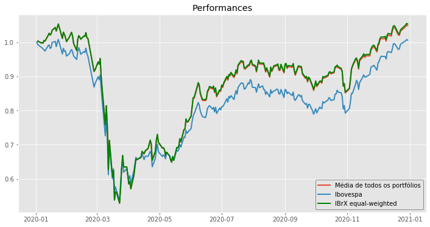
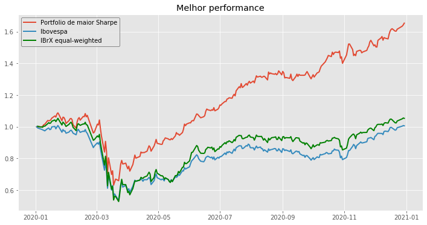
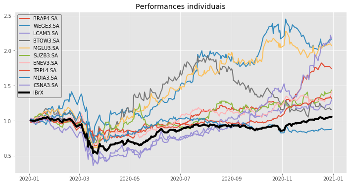

## Se no dia 1 de janeiro de 2020 você selecionasse aleatoriamente 10 ações do IBrX-100, quais seriam suas chances de bater o retorno do índice? Além disso, quais seriam as chances do seu portfólio bater o índice em Sharpe?

Burton Malkiel, autor do livro _A Random Walk Down Wall Street_, argumenta em sua obra que até um macaco jogando dardos de olhos vendados em uma lista de ações seria capaz de gerar melhores performances que fundos gerenciados por profissionais. A argumentação tem forte embasamento na teoria de finanças comportamentais, e o autor utiliza diversas razões para explicá-la, sendo uma delas o fato do mercado se comportar como um “passeio aleatório”. 

A priori, a afirmação soa um tanto quanto estranha e duvidosa, afinal, como um primata de olhos vendados poderia de alguma forma ser um melhor gestor que um humano capacitado que passa anos de sua vida estudando os mercados? Essa indagação me motivou a fazer uma breve análise e levantar alguns questionamentos sobre a tal aleatoriedade no mercado de ações, especificamente o brasileiro.

Supondo composições de portfólios de 10 ações, se existem 100 ações no índice IBrX-100, vemos que mais de 17 trilhões de combinações diferentes são possíveis, um número estrondosamente alto. Dentre essas possibilidades, fiz uma simulação de 100 mil portfólios diferentes, compostos por 10 ações (não repetidas) escolhidas de maneira totalmente aleatória.

### Importo as bibliotecas necessárias


```python
import numpy as np
import pandas as pd
import pandas_datareader as dt
import matplotlib.pyplot as plt
import random
import math
```

### Importo os dados


```python
# Importo um csv com os dados das ações do ibrx em setembro de 2020
ibrx = pd.read_csv('ibrx2020.csv')

# Transformo em uma lista
stocks = list(ibrx['Ativo'])
stocks.remove('VIVT4.SA')

# Importo os dados dos preços diários (fonte: yahoo finance)
prices_df = pd.read_csv('precos_yahoo.csv', index_col=0, parse_dates=True)

# Pego os dados do ibovespa separadamente
start_date = '2020-01-01'
ibov = dt.DataReader('^BVSP', start=start_date, data_source='yahoo')['Adj Close']    
```

### Calculando os retornos


```python
# Limito as datas ao final do ano
prices_df = prices_df[:'2021-01-01']
ibov = ibov[:'2021-01-01']
```


```python
# Calculo os retornos diarios de cada acao e do ibovespa
daily_returns = prices_df.pct_change()
ibov_returns = ibov.pct_change()
```

### Simulando os portfólios


```python
# Faço um dicionario com o retorno total, vol e sharpe de cada portfolio randomico
# Os pesos são distribuídos igualmente entre as ações

random_returns = {}
number = 10 # número de ações por carteira
n_test = 100000 # número de portfolios

for i in range(0, n_test):
    random_tickers = list(prices_df.columns[random.sample(range(len(stocks)-1), number)])
    returns = daily_returns[random_tickers].sum(axis=1)/number
    vol = returns.std()*(252**0.5)
    sharpe = (returns.mean()/returns.std())*(252**0.5)
    random_returns.update({i:[returns, random_tickers, vol, sharpe]})
```


```python
# Existem mais de 17 trilhões de combinacoes possíveis de portfolios com 10 ações
print(math.factorial(100)/(math.factorial((100-number))*math.factorial(number)))
```


    17310309456440.0


### Retornos


```python
# Crio uma lista de retornos que irá conter um pd.Series de retornos para cada portfolio
return_list = []
for i in range(0, n_test):
    return_list.append(random_returns[i][0])
```


```python
# Agrupo os retornos em apenas um dataframe
rand_returns_df = pd.concat(return_list, axis=1)
rand_returns_df.columns = list(range(0, n_test)) 

#Calculo a performance
rand_performance = rand_returns_df.add(1).cumprod()

#Retornos do ibrx
ibrx_returns = daily_returns.sum(axis=1)/daily_returns.count(axis=1)

#Performance do ibrx
ibrx_perf = ibrx_returns.add(1).cumprod()
```

### Análise dos resultados

Destes 100 mil portfólios, 46,18 mil (46,18%) ganharam do IBrX em retorno. Em relação aos retornos, parece que bater o índice não é uma tarefa tão fácil assim... 


```python
# Quantos porfolios batem o ibrx em questão de retorno?
winners = list(rand_performance.tail(1)[rand_performance.tail(1)>ibrx_perf.tail(1)[0]].dropna(axis=1).columns)
loosers = list(rand_performance.tail(1)[rand_performance.tail(1)<ibrx_perf.tail(1)[0]].dropna(axis=1).columns)

print('Performance: \nGanhadores: {:.2%} \nPerdedores: {:.2%} \n'.format(len(winners)/n_test, len(loosers)/n_test))
```

    Performance: 
    Ganhadores: 46.18% 
    Perdedores: 53.82% 
    
    


```python
# Crio uma lista de dos sharpes
sharpe_dict = {}
for i in range(0, n_test):
    sharpe_dict.update({i:random_returns[i][3]})
    
# Sharpe ibov
ibov_sharpe = ibov_returns.mean()/ibov_returns.std()*(252**0.5)

#Sharpe IBRX
ibrx_sharpe = ibrx_returns.mean()/ibrx_returns.std()*(252**0.5)
```

Algo semelhante é encontrado em relação ao Sharpe desses portfólios. Quase metade (46,99%) deles superaram o Sharpe do IBrX. Poderíamos dizer que se o macaco de olhos vendados jogasse 10 dardos em ações do IBrX no início do ano, a chance de ele ganhar do índice seria quase a mesma de ele perder. Porém, podemos fazer uma comparação com o índice Ibovespa, que é amplamente utilizado como benchmark dos fundos de ações.


```python
# Quantos porfolios batem o ibrx em sharpe?

s_winners = list(pd.Series(sharpe_dict)[pd.Series(sharpe_dict)>ibrx_sharpe].index)
s_loosers = list(pd.Series(sharpe_dict)[pd.Series(sharpe_dict)<ibrx_sharpe].index)

print('Sharpe: \nGanhadores: {:.2%} \nPerdedores: {:.2%} \n'.format(len(s_winners)/n_test, len(s_loosers)/n_test))
```

    Sharpe: 
    Ganhadores: 46.99% 
    Perdedores: 53.01% 
    
    


```python
# Performance acumulada do ibov
ibov_last = (ibov/ibov.iloc[0]).tail(1)[0]
```

##### E se compararmos ao Ibovespa?

Poderíamos dizer que o macaco teria um pouco mais de... sorte? Destes 100 mil portfólios, 62,74 mil (62,74%) ganharam do Ibovespa em retorno.

Se tratando do índice de Sharpe, obtemos resultados mais interessantes ainda. 67,52% dos portfólios ganharam do Ibovespa nesse quesito.


```python
# Quantos porfolios batem o ibovespa em questão de retorno?
winners = list(rand_performance.tail(1)[rand_performance.tail(1)>ibov_last].dropna(axis=1).columns)
loosers = list(rand_performance.tail(1)[rand_performance.tail(1)<ibov_last].dropna(axis=1).columns)

print('Performance: \nGanhadores: {:.2%} \nPerdedores: {:.2%} \n'.format(len(winners)/n_test, len(loosers)/n_test))
```

    Performance: 
    Ganhadores: 62.74% 
    Perdedores: 37.26% 
    
    


```python
# Quantos porfolios batem o ibovespa em sharpe?
s_winners = list(pd.Series(sharpe_dict)[pd.Series(sharpe_dict)>ibov_sharpe].index)
s_loosers = list(pd.Series(sharpe_dict)[pd.Series(sharpe_dict)<ibov_sharpe].index)

print('Sharpe: \nGanhadores: {:.2%} \nPerdedores: {:.2%} \n'.format(len(s_winners)/n_test, len(s_loosers)/n_test))
```

    Sharpe: 
    Ganhadores: 67.52% 
    Perdedores: 32.48% 
    
    

## Gráficos


```python
# Convergência à média: O retorno médio dos portfolios tende a convergir aos retornos do índice ibrx

plt.style.use('ggplot')
fig = plt.figure(figsize=(12, 6))
ax = fig.add_subplot(1, 1, 1)
ax.plot((rand_performance.sum(axis=1)/rand_performance.count(axis=1)), label='Média de todos os portfólios', lw=2)
ax.plot((ibov/ibov.iloc[0]), label='Ibovespa', lw=2)
ax.plot((daily_returns.sum(axis=1)/daily_returns.count(axis=1)).add(1).cumprod(), color='green', label='IBrX equal-weighted', lw=2)
ax.legend(loc='best', edgecolor='black')
ax.set_title('Performances')
plt.show()
```





```python
# Composição da carteira de melhor sharpe e sua performance
random_returns[pd.Series(sharpe_dict)[pd.Series(sharpe_dict)>ibov_sharpe].sort_values().tail(1).index[0]][1]
```


    ['BRAP4.SA',
     'WEGE3.SA',
     'LCAM3.SA',
     'BTOW3.SA',
     'MGLU3.SA',
     'SUZB3.SA',
     'ENEV3.SA',
     'TRPL4.SA',
     'MDIA3.SA',
     'CSNA3.SA']


```python
fig = plt.figure(figsize=(12, 6))
ax = fig.add_subplot(1, 1, 1)
ax.plot(rand_performance[pd.Series(sharpe_dict)[pd.Series(sharpe_dict)>ibov_sharpe].sort_values().tail(1).index[0]], label='Portfolio de maior Sharpe', lw=2)
ax.plot((ibov/ibov.iloc[0]), label='Ibovespa', lw=2)
ax.plot((daily_returns.sum(axis=1)/daily_returns.count(axis=1)).add(1).cumprod(), label='IBrX equal-weighted', lw=2, c='green')
ax.legend(loc='best', edgecolor='black')
ax.set_title('Melhor performance')
plt.show()
```





```python
# Performance individual das ações da melhor carteira 
fig = plt.figure(figsize=(12, 6))
ax = fig.add_subplot(1, 1, 1)
ax.plot((prices_df[random_returns[pd.Series(sharpe_dict)[pd.Series(sharpe_dict)>ibov_sharpe].sort_values().tail(1).index[0]][1]]/prices_df[random_returns[pd.Series(sharpe_dict)[pd.Series(sharpe_dict)>ibov_sharpe].sort_values().tail(1).index[0]][1]].iloc[0]), lw=2)
ax.plot((daily_returns.sum(axis=1)/daily_returns.count(axis=1)).add(1).cumprod(), label='IBrX equal-weighted', lw=4, c='black')
ax.legend(random_returns[pd.Series(sharpe_dict)[pd.Series(sharpe_dict)>ibov_sharpe].sort_values().tail(1).index[0]][1] + ['IBrX'],loc='best', edgecolor='black')
ax.set_title('Performances individuais')
plt.show()
```





