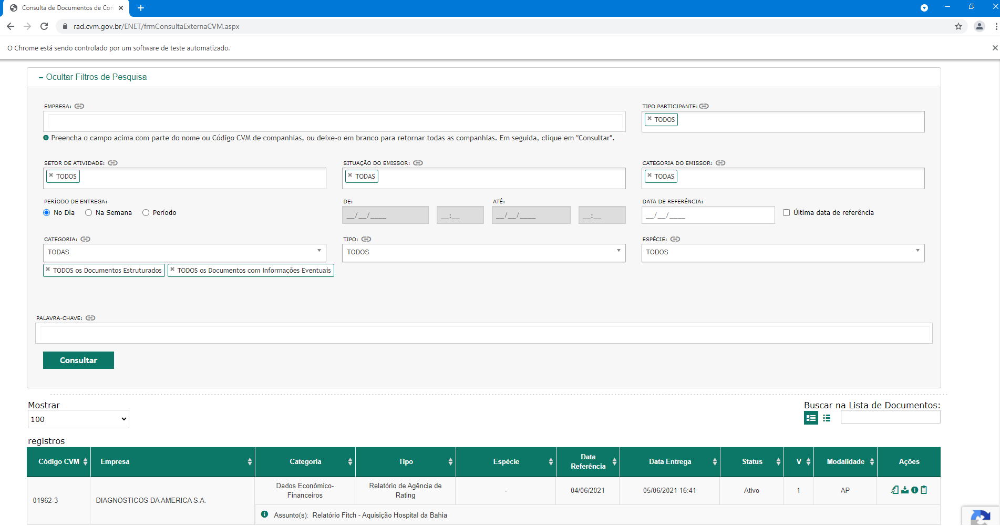
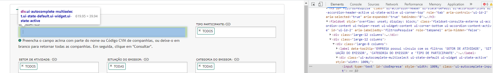

## Uso do RSelenium

Uma das ferramentas mais comuns para a criação de robôs automatizados é
o Selenium. O que muita gente não sabe é que existe uma versão da
ferramenta que pode ser usada pelo R. Essa versão é chamada de
RSelenium, que permite a fácil criação de bots para a extração de
informações e *web scrapping* de maneira intuitiva. A seguir
demonstraremos como usar essa ferramenta de modo simples. Nesse tutorial
mostraremos como baixar um fato relevante de uma empresa do site de
consulta externa da CVM.

Antes de instalar o RSelenium, será explicado brevemente o que é um fato
relevante. Basicamente, um fato relevante é um comunicado oficial de uma
empresa que informa sobre eventos que possam afetar o valor de suas ações ou
influenciar os investidores na venda ou na compra delas. Sendo assim, a
comissão de valores mobiliários define que as companhias listadas na B3,
a bolsa de valores brasileira,devem informar tais acontecimentos
imediatamente ao mercado e à imprensa. Exemplos de Fatos relevantes
podem ser: Divisões, fusões, renegociação da dívida, descoberta de novas
tecnologias ou recursos e etc. No entanto, antes de acessar esses fatos relevantes,
primeiro devemos instalar o pacote RSelenium:

------------------------------------------------------------------------

    ##Instalação
    install.packages("RSelenium")

    ##Carregar o pacote da biblioteca
    library(RSelenium)

------------------------------------------------------------------------

Para começar a usar o RSelenium, é primeiro necessário criar um servidor
para o drive remoto e o drive remoto em si. Esse drive remoto será o
robô que acessará e criará a instância automatizada do seu navegador.
Para esse tutorial será usado o Google Chrome. Algumas das linhas de
código e exemplos utilizados serão específicas para o navegador, mas o
RSelenium pode ser utilizado também com o Firefox, IE, Safari e Opera,
tanto que, por padrão, o RSelenium buscará o Firefox.

A seguir, temos o código que criará um drive remoto e abrirá uma nova
instância do Chrome.

    #Cria o servidor
    rD <- rsDriver(port = 4812L,
             ##Define a versão do Chrome que o Webdriver deve utilizar     
             #chromever = '86.0.4240.22',
             ##Remove as informações do console
             verbose = F)

    #Cria o driver para usar o R
    remDr <- remoteDriver(
      remoteServerAddr = "localhost",
      port = 4812L,
      browserName = "chrome"
    )

    #Abre o servidor
    remDr$open()

Depois de executado o código, você terá duas instâncias automatizadas do
chrome abertas, uma do servidor e outra do drive remoto que o código
estará controlando. Devido a natureza dos fatos relevantes, eles estão
disponíveis para consulta externa. A seguir iremos até o site de onde
baixaremos o fato relevante. Para isso, usaremos o comando navigate do
drive remoto.

    #Navega até a página
    remDr$navigate("https://www.rad.cvm.gov.br/ENET/frmConsultaExternaCVM.aspx")

Repare que o RSelenium segue uma lógica muito parecida com a da
linguagem orientada a objeto, como a do Python, por exemplo. Temos o
objeto “remDr” que tem o comando/função navigate. Depois de executado,
sua instância automatizada deverá estar na seguinte página:

Agora queremos especificamente um fato relevante da empresa Vale S.A.
Para isso, é necessário preencher a barra de pesquisa "empresa". Como é
possível fazer o nosso drive remoto encontrá-la? Inicialmente, é necessário
entender que toda página da web é um documento html e em um documento
html todo elemento que popula a página terá atributos que o
caracterizam.

Porém, como encontrar os atributos e os elementos? O jeito mais fácil é
inspecionar um elemento, apertando-o o com o botão direito do mouse e
então selecionar a opção de inspecionar:

Com isso descobrimos os atributos do elemento como a classe, o id, o
estilo e etc. Aproveitando o modelo do site, usaremos o id para
selecionarmos o elemento.

------------------------------------------------------------------------

    #Encontra a barra de pesquisa da empresa
    pesquisa <- remDr$findElement(using = "id", 
                                 value = "cboEmpresa")
    #Olha a classe
    pesquisa$getElementAttribute("class")
    #Clica
    pesquisa$clickElement()

Com isso criamos um novo objeto com a localização da barra de pesquisa
desejada. Podemos ainda realçar o elemento selecionado para conferir se
foi selecionado o correto com o seguinte comando:

    #Confere se selecionou o elemento certo
    pesquisa$highlightElement()

Confirmado que selecionamos a barra de pesquisa, devemos preenchê-la.
Como queremos um fato relevante da empresa Vale S.A, iremos escrever o
nome dela. Entretanto, como a barra de pesquisa tem o autocomplete,
temos que ainda selecionar a única opção da lista e clicá-la. Usaremos
isso procurando pela classe dessa opção.

    #Envia o que precisa ser digitado
    pesquisa$sendKeysToElement(list('Vale S.A.'))

    #Escolhe a primeira sugestão do autocompletar
    empresa <- remDr$findElement(using = "class", 
                                 value = "ui-menu-item")
    empresa$clickElement()

Repare como criamos um novo objeto no R quando selecionamos um novo
elemento no browser. Além disso, outra opção para resolver o
autocomplete seria:

    pesquisa$sendKeysToElement(list(key="up_arrow", key='enter'))

Que pressiona a seta para cima e o botão enter em sequência.

É importante ressaltar que todos os comandos que devem ser executados
pela função anterior devem estar contidos numa lista, mesmo que eles
sejam somente um comando.

Com isso, já aprendemos como encontrar um elemento, clicar nele e enviar
comandos para ele. Usando essas funções aprendidas, iremos definir um
período para a pesquisa de fatos relevantes e clicaremos no botão de
consulta.

------------------------------------------------------------------------

    #Clica para selecionar a opção período
    periodo <- remDr$findElement(using = "id",
                                value = "rdPeriodo")
    periodo$clickElement()
    #Clica para preencher o início do período
    #Acha
    Inicio <- remDr$findElement(using = "id", 
                                value = "txtDataIni")
    #Clica
    Inicio$clickElement()
    #Envia
    Inicio$sendKeysToElement(list('01062021'))

    #Clica para preencher o fim do período
    #Acha
    Fim <- remDr$findElement(using = "id", 
                                value = "txtDataFim")

    #Clica
    Fim$clickElement()
    #Envia
    Fim$sendKeysToElement(list('01062021'))

    #Clica para consultar
    consulta <- remDr$findElement(using = "id",
                                  value = "btnConsulta")
    consulta$clickElement()

Por motivos didáticos, será escolhido o dia primeiro de junho de 2021
para fazermos a consulta. Como você poderá ver, nesse dia há um fato
relevante da empresa. Sendo assim, iremos encontrar todos os botões de
download da página e clicaremos no primeiro deles.

------------------------------------------------------------------------

    #Seleciona a tabela
    tabela <- remDr$findElement(using = "id", 
                                  value = "grdDocumentos")
      
    #Acha os botoes de dowload
    btnDownloads <- tabela$findChildElements(using = 'class', 
                                               value = 'fi-download')
    #Clica no primeiro botão de download
    btnDownloads[[1]]$clickElement()  

Repare que o objeto `btnDownloads` é uma lista, já que a função
`findChildElements` encontra todos os elementos que estão ligados
hierarquicamente ao objeto anterior. Logo, é necessário o uso do índice
de lista para clicar no botão desejado. Portanto, caso houvesse mais de
um fato relevante no período pesquisado, teríamos uma lista com todos os
botões de downloads da tabela, visto que o código executado busca todos
elementos “filhos” dentro da tabela que são da categoria
`'fi-download'`, o que permitiria facilmente a criação de um looping
para baixá-los.

Pronto, com isso foi feito o download do fato relevante e demonstradas
todas as funcionalidades básicas do RSelenium. Entendendo elas não é
necessário ter um conhecimento muito aprofundado em R para criar robôs
de webscrapping.

Antes de terminar o tutorial, é bom lembrar que o servidor e o driver
remoto estarão funcionando e ocupando o port da internet até que seja
fechado o R ou usado o código:

    #Fecha o driver
    remDr$close()
    #Para o servidor
    rD$server$stop()

    #Remove os objetos
    rm(rD, remDr)
    gc()

    #Mata processos em java
    system("taskkill /im java.exe /f", intern=FALSE, ignore.stdout=FALSE)

Sendo assim, está terminada a demonstração de como criar um robô básico
e usar as funcionalidades do RSelenium.
