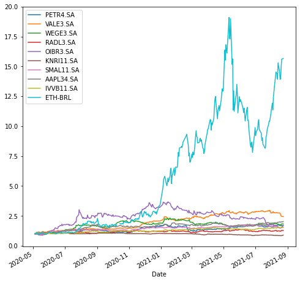
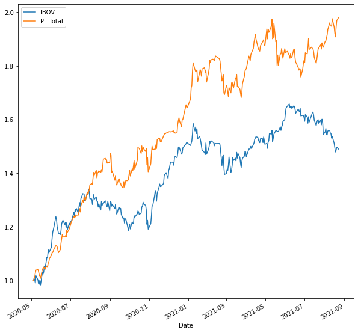

Nesse post, vou mostrar como fazer como comparar uma carteira qualquer com o IBOV utilizando o python. 


# 1. Instalando e importando bibliotecas


```python
!pip install yfinance
```


```python
import yfinance as yf
```


```python
import yfinance as yf
import pandas as pd
import numpy as np
```

# 2. Importando dados

Repare que vou importar também os dados da cotação do dólar. Posteriormente vou converter a cotação do Ethereum para reais, por isso que estou trazendo a cotação do dólar. Ou seja, multiplicar a cotação de Dolar-Real pelo preço do ETH em dólar para obter o preço do ETH em real.

Criando o vetor dos tickers.
```python
ativos = ['PETR4.SA','VALE3.SA', 'WEGE3.SA', 
          'RADL3.SA', 'OIBR3.SA','KNRI11.SA',
          'SMAL11.SA','AAPL34.SA','IVVB11.SA','ETH-USD','USDBRL=X']
```

Criando uma data de inicio e de fim da captação de dados.

```python
inicio = '2020-05-01'
fim = '2021-08-24'
```

Criando o data.frame dos preços.
```python
precos = pd.DataFrame()

Baixando as cotações
for i in ativos:
  precos[i] = yf.download(i, start = inicio, end = fim)['Adj Close']
```

Vamos converter a cotação do Ethereum para reais:


```python
precos['ETH-BRL'] = precos['ETH-USD']*precos['USDBRL=X']
```

Agora podemos remover as colunas do Ethereum em dólares e da cotação do dólar


```python
precos = precos.drop(columns=['ETH-USD', 'USDBRL=X'])
```


```python
precos.to_csv('Dados.csv', sep = ';', decimal=',')
```

Vamos normalizar o preço dos ativos para visualizar seus desempenhos.


```python
normalizado = precos/precos.iloc[0]
```


```python
normalizado.plot(figsize = (8,8));
```


    

    


## 3. Simulação de uma carteira vs. IBOV

Criando um dicionário com as alocações que vamos fazer para cada ativo na nossa carteira


```python
compras = {'PETR4.SA': 1000, 'VALE3.SA': 700, 'WEGE3.SA': 1500, 
           'RADL3.SA': 700, 'OIBR3.SA': 200, 'KNRI11.SA': 700, 
           'SMAL11.SA': 1500, 'AAPL34.SA': 2000, 'IVVB11.SA': 1500, 
           'ETH-BRL': 200}
           
compras_df = pd.Series(data=compras, index=list(compras.keys()))
```

Qual o valor total da nossa carteira?


```python
sum(compras.values())
```


    10000


Obtendo preços dos ativos no primeiro dia do investimento


```python
primeiro = precos.iloc[0]
```

Quantidade de papéis comprados de cada ativo


```python
qtd_acoes = compras_df/primeira
```

Criando um dataframe que contém a posição diária de cada ativo


```python
PL = precos*qtd_acoes
```


```python
PL.head(3)
```


<div>
<style scoped>
    .dataframe tbody tr th:only-of-type {
        vertical-align: middle;
    }

    .dataframe tbody tr th {
        vertical-align: top;
    }

    .dataframe thead th {
        text-align: right;
    }
</style>
<table border="1" class="dataframe">
  <thead>
    <tr style="text-align: right;">
      <th></th>
      <th>PETR4.SA</th>
      <th>VALE3.SA</th>
      <th>WEGE3.SA</th>
      <th>RADL3.SA</th>
      <th>OIBR3.SA</th>
      <th>KNRI11.SA</th>
      <th>SMAL11.SA</th>
      <th>AAPL34.SA</th>
      <th>IVVB11.SA</th>
      <th>ETH-BRL</th>
    </tr>
    <tr>
      <th>Date</th>
      <th></th>
      <th></th>
      <th></th>
      <th></th>
      <th></th>
      <th></th>
      <th></th>
      <th></th>
      <th></th>
      <th></th>
    </tr>
  </thead>
  <tbody>
    <tr>
      <th>2020-05-04</th>
      <td>1000.000000</td>
      <td>700.000000</td>
      <td>1500.000000</td>
      <td>700.000000</td>
      <td>200.000000</td>
      <td>700.000000</td>
      <td>1500.000000</td>
      <td>2000.000000</td>
      <td>1500.000000</td>
      <td>200.000000</td>
    </tr>
    <tr>
      <th>2020-05-05</th>
      <td>1032.221098</td>
      <td>696.335118</td>
      <td>1468.750176</td>
      <td>696.987266</td>
      <td>205.882347</td>
      <td>702.685449</td>
      <td>1479.377360</td>
      <td>2059.369090</td>
      <td>1526.950431</td>
      <td>200.962154</td>
    </tr>
    <tr>
      <th>2020-05-06</th>
      <td>994.246331</td>
      <td>706.373761</td>
      <td>1461.973107</td>
      <td>693.037478</td>
      <td>205.882347</td>
      <td>717.231486</td>
      <td>1462.333842</td>
      <td>2137.167589</td>
      <td>1548.315577</td>
      <td>199.662245</td>
    </tr>
  </tbody>
</table>
</div>


```python
PL.tail()
```


<div>
<style scoped>
    .dataframe tbody tr th:only-of-type {
        vertical-align: middle;
    }

    .dataframe tbody tr th {
        vertical-align: top;
    }

    .dataframe thead th {
        text-align: right;
    }
</style>
<table border="1" class="dataframe">
  <thead>
    <tr style="text-align: right;">
      <th></th>
      <th>PETR4.SA</th>
      <th>VALE3.SA</th>
      <th>WEGE3.SA</th>
      <th>RADL3.SA</th>
      <th>OIBR3.SA</th>
      <th>KNRI11.SA</th>
      <th>SMAL11.SA</th>
      <th>AAPL34.SA</th>
      <th>IVVB11.SA</th>
      <th>ETH-BRL</th>
    </tr>
    <tr>
      <th>Date</th>
      <th></th>
      <th></th>
      <th></th>
      <th></th>
      <th></th>
      <th></th>
      <th></th>
      <th></th>
      <th></th>
      <th></th>
    </tr>
  </thead>
  <tbody>
    <tr>
      <th>2021-08-17</th>
      <td>1703.360143</td>
      <td>1892.935908</td>
      <td>2648.266605</td>
      <td>855.407388</td>
      <td>299.999991</td>
      <td>594.955233</td>
      <td>2217.361714</td>
      <td>3962.566078</td>
      <td>2256.649004</td>
      <td>2781.549609</td>
    </tr>
    <tr>
      <th>2021-08-18</th>
      <td>1688.235983</td>
      <td>1829.425319</td>
      <td>2563.528423</td>
      <td>852.039629</td>
      <td>297.058818</td>
      <td>595.134300</td>
      <td>2220.259080</td>
      <td>3953.062200</td>
      <td>2273.936211</td>
      <td>2804.717612</td>
    </tr>
    <tr>
      <th>2021-08-19</th>
      <td>1678.783279</td>
      <td>1725.048452</td>
      <td>2686.437068</td>
      <td>883.022892</td>
      <td>299.999991</td>
      <td>587.659883</td>
      <td>2275.309569</td>
      <td>3985.575125</td>
      <td>2308.422157</td>
      <td>3002.797046</td>
    </tr>
    <tr>
      <th>2021-08-20</th>
      <td>1676.262645</td>
      <td>1725.756108</td>
      <td>2746.746469</td>
      <td>898.177773</td>
      <td>305.882339</td>
      <td>596.566489</td>
      <td>2316.384508</td>
      <td>3993.578089</td>
      <td>2303.102954</td>
      <td>3121.606584</td>
    </tr>
    <tr>
      <th>2021-08-23</th>
      <td>1702.729955</td>
      <td>1701.873164</td>
      <td>2729.188091</td>
      <td>892.452603</td>
      <td>338.235284</td>
      <td>623.196980</td>
      <td>2316.213906</td>
      <td>4037.095425</td>
      <td>2332.358166</td>
      <td>3131.866252</td>
    </tr>
  </tbody>
</table>
</div>


Criando uma coluna que contém a posição consolidada da nossa carteira diariamente


```python
PL['PL Total'] = PL.iloc[:].sum(axis = 1)
```


```python
PL.head()
```


<div>
<style scoped>
    .dataframe tbody tr th:only-of-type {
        vertical-align: middle;
    }

    .dataframe tbody tr th {
        vertical-align: top;
    }

    .dataframe thead th {
        text-align: right;
    }
</style>
<table border="1" class="dataframe">
  <thead>
    <tr style="text-align: right;">
      <th></th>
      <th>PETR4.SA</th>
      <th>VALE3.SA</th>
      <th>WEGE3.SA</th>
      <th>RADL3.SA</th>
      <th>OIBR3.SA</th>
      <th>KNRI11.SA</th>
      <th>SMAL11.SA</th>
      <th>AAPL34.SA</th>
      <th>IVVB11.SA</th>
      <th>ETH-BRL</th>
      <th>PL Total</th>
    </tr>
    <tr>
      <th>Date</th>
      <th></th>
      <th></th>
      <th></th>
      <th></th>
      <th></th>
      <th></th>
      <th></th>
      <th></th>
      <th></th>
      <th></th>
      <th></th>
    </tr>
  </thead>
  <tbody>
    <tr>
      <th>2020-05-04</th>
      <td>1000.000000</td>
      <td>700.000000</td>
      <td>1500.000000</td>
      <td>700.000000</td>
      <td>200.000000</td>
      <td>700.000000</td>
      <td>1500.000000</td>
      <td>2000.000000</td>
      <td>1500.000000</td>
      <td>200.000000</td>
      <td>10000.000000</td>
    </tr>
    <tr>
      <th>2020-05-05</th>
      <td>1032.221098</td>
      <td>696.335118</td>
      <td>1468.750176</td>
      <td>696.987266</td>
      <td>205.882347</td>
      <td>702.685449</td>
      <td>1479.377360</td>
      <td>2059.369090</td>
      <td>1526.950431</td>
      <td>200.962154</td>
      <td>10069.520489</td>
    </tr>
    <tr>
      <th>2020-05-06</th>
      <td>994.246331</td>
      <td>706.373761</td>
      <td>1461.973107</td>
      <td>693.037478</td>
      <td>205.882347</td>
      <td>717.231486</td>
      <td>1462.333842</td>
      <td>2137.167589</td>
      <td>1548.315577</td>
      <td>199.662245</td>
      <td>10126.223764</td>
    </tr>
    <tr>
      <th>2020-05-07</th>
      <td>1003.452454</td>
      <td>733.780947</td>
      <td>1471.762093</td>
      <td>694.175587</td>
      <td>197.058826</td>
      <td>716.112560</td>
      <td>1431.655459</td>
      <td>2199.999886</td>
      <td>1622.340455</td>
      <td>212.823946</td>
      <td>10283.162213</td>
    </tr>
    <tr>
      <th>2020-05-08</th>
      <td>1063.291199</td>
      <td>778.397410</td>
      <td>1439.759181</td>
      <td>700.803383</td>
      <td>202.941174</td>
      <td>727.301819</td>
      <td>1433.359785</td>
      <td>2220.108426</td>
      <td>1602.393646</td>
      <td>217.769114</td>
      <td>10386.125134</td>
    </tr>
  </tbody>
</table>
</div>


```python
PL.tail()
```


<div>
<style scoped>
    .dataframe tbody tr th:only-of-type {
        vertical-align: middle;
    }

    .dataframe tbody tr th {
        vertical-align: top;
    }

    .dataframe thead th {
        text-align: right;
    }
</style>
<table border="1" class="dataframe">
  <thead>
    <tr style="text-align: right;">
      <th></th>
      <th>PETR4.SA</th>
      <th>VALE3.SA</th>
      <th>WEGE3.SA</th>
      <th>RADL3.SA</th>
      <th>OIBR3.SA</th>
      <th>KNRI11.SA</th>
      <th>SMAL11.SA</th>
      <th>AAPL34.SA</th>
      <th>IVVB11.SA</th>
      <th>ETH-BRL</th>
      <th>PL Total</th>
    </tr>
    <tr>
      <th>Date</th>
      <th></th>
      <th></th>
      <th></th>
      <th></th>
      <th></th>
      <th></th>
      <th></th>
      <th></th>
      <th></th>
      <th></th>
      <th></th>
    </tr>
  </thead>
  <tbody>
    <tr>
      <th>2021-08-17</th>
      <td>1703.360143</td>
      <td>1892.935908</td>
      <td>2648.266605</td>
      <td>855.407388</td>
      <td>299.999991</td>
      <td>594.955233</td>
      <td>2217.361714</td>
      <td>3962.566078</td>
      <td>2256.649004</td>
      <td>2781.549609</td>
      <td>19213.051672</td>
    </tr>
    <tr>
      <th>2021-08-18</th>
      <td>1688.235983</td>
      <td>1829.425319</td>
      <td>2563.528423</td>
      <td>852.039629</td>
      <td>297.058818</td>
      <td>595.134300</td>
      <td>2220.259080</td>
      <td>3953.062200</td>
      <td>2273.936211</td>
      <td>2804.717612</td>
      <td>19077.397575</td>
    </tr>
    <tr>
      <th>2021-08-19</th>
      <td>1678.783279</td>
      <td>1725.048452</td>
      <td>2686.437068</td>
      <td>883.022892</td>
      <td>299.999991</td>
      <td>587.659883</td>
      <td>2275.309569</td>
      <td>3985.575125</td>
      <td>2308.422157</td>
      <td>3002.797046</td>
      <td>19433.055463</td>
    </tr>
    <tr>
      <th>2021-08-20</th>
      <td>1676.262645</td>
      <td>1725.756108</td>
      <td>2746.746469</td>
      <td>898.177773</td>
      <td>305.882339</td>
      <td>596.566489</td>
      <td>2316.384508</td>
      <td>3993.578089</td>
      <td>2303.102954</td>
      <td>3121.606584</td>
      <td>19684.063959</td>
    </tr>
    <tr>
      <th>2021-08-23</th>
      <td>1702.729955</td>
      <td>1701.873164</td>
      <td>2729.188091</td>
      <td>892.452603</td>
      <td>338.235284</td>
      <td>623.196980</td>
      <td>2316.213906</td>
      <td>4037.095425</td>
      <td>2332.358166</td>
      <td>3131.866252</td>
      <td>19805.209825</td>
    </tr>
  </tbody>
</table>
</div>


Obtendo dados do IBOV para comparar com a nossa carteira


```python
ibov = yf.download('^BVSP', start = inicio, end = fim)
```

    [*********************100%***********************]  1 of 1 completed
    


```python
ibov.head()
```


<div>
<style scoped>
    .dataframe tbody tr th:only-of-type {
        vertical-align: middle;
    }

    .dataframe tbody tr th {
        vertical-align: top;
    }

    .dataframe thead th {
        text-align: right;
    }
</style>
<table border="1" class="dataframe">
  <thead>
    <tr style="text-align: right;">
      <th></th>
      <th>Open</th>
      <th>High</th>
      <th>Low</th>
      <th>Close</th>
      <th>Adj Close</th>
      <th>Volume</th>
    </tr>
    <tr>
      <th>Date</th>
      <th></th>
      <th></th>
      <th></th>
      <th></th>
      <th></th>
      <th></th>
    </tr>
  </thead>
  <tbody>
    <tr>
      <th>2020-05-04</th>
      <td>80501.0</td>
      <td>80502.0</td>
      <td>77640.0</td>
      <td>78876.0</td>
      <td>78876.0</td>
      <td>8594200</td>
    </tr>
    <tr>
      <th>2020-05-05</th>
      <td>78887.0</td>
      <td>81066.0</td>
      <td>78886.0</td>
      <td>79471.0</td>
      <td>79471.0</td>
      <td>9154700</td>
    </tr>
    <tr>
      <th>2020-05-06</th>
      <td>79473.0</td>
      <td>79996.0</td>
      <td>78056.0</td>
      <td>79064.0</td>
      <td>79064.0</td>
      <td>9775900</td>
    </tr>
    <tr>
      <th>2020-05-07</th>
      <td>79072.0</td>
      <td>80061.0</td>
      <td>78061.0</td>
      <td>78119.0</td>
      <td>78119.0</td>
      <td>13808900</td>
    </tr>
    <tr>
      <th>2020-05-08</th>
      <td>78152.0</td>
      <td>80557.0</td>
      <td>78152.0</td>
      <td>80263.0</td>
      <td>80263.0</td>
      <td>10734400</td>
    </tr>
  </tbody>
</table>
</div>


```python
ibov.rename(columns = {'Adj Close': 'IBOV'}, inplace = True)
```


```python
ibov = ibov.drop(ibov.columns[[0,1,2,3,5]], axis = 1)
```


```python
ibov
```


<div>
<style scoped>
    .dataframe tbody tr th:only-of-type {
        vertical-align: middle;
    }

    .dataframe tbody tr th {
        vertical-align: top;
    }

    .dataframe thead th {
        text-align: right;
    }
</style>
<table border="1" class="dataframe">
  <thead>
    <tr style="text-align: right;">
      <th></th>
      <th>IBOV</th>
    </tr>
    <tr>
      <th>Date</th>
      <th></th>
    </tr>
  </thead>
  <tbody>
    <tr>
      <th>2020-05-04</th>
      <td>78876.0</td>
    </tr>
    <tr>
      <th>2020-05-05</th>
      <td>79471.0</td>
    </tr>
    <tr>
      <th>2020-05-06</th>
      <td>79064.0</td>
    </tr>
    <tr>
      <th>2020-05-07</th>
      <td>78119.0</td>
    </tr>
    <tr>
      <th>2020-05-08</th>
      <td>80263.0</td>
    </tr>
    <tr>
      <th>...</th>
      <td>...</td>
    </tr>
    <tr>
      <th>2021-08-17</th>
      <td>117904.0</td>
    </tr>
    <tr>
      <th>2021-08-18</th>
      <td>116643.0</td>
    </tr>
    <tr>
      <th>2021-08-19</th>
      <td>117165.0</td>
    </tr>
    <tr>
      <th>2021-08-20</th>
      <td>118053.0</td>
    </tr>
    <tr>
      <th>2021-08-23</th>
      <td>117472.0</td>
    </tr>
  </tbody>
</table>
<p>324 rows × 1 columns</p>
</div>


Verificando se o índice dos dataframes está no formato 'data'


```python
ibov.index = pd.to_datetime(ibov.index)
```


```python
PL.index = pd.to_datetime(PL.index)
```

Juntando tudo num dataframe só


```python
novo_df = pd.merge(ibov, PL, how = 'inner', on = 'Date')
```


```python
novo_df.head()
```


<div>
<style scoped>
    .dataframe tbody tr th:only-of-type {
        vertical-align: middle;
    }

    .dataframe tbody tr th {
        vertical-align: top;
    }

    .dataframe thead th {
        text-align: right;
    }
</style>
<table border="1" class="dataframe">
  <thead>
    <tr style="text-align: right;">
      <th></th>
      <th>IBOV</th>
      <th>PETR4.SA</th>
      <th>VALE3.SA</th>
      <th>WEGE3.SA</th>
      <th>RADL3.SA</th>
      <th>OIBR3.SA</th>
      <th>KNRI11.SA</th>
      <th>SMAL11.SA</th>
      <th>AAPL34.SA</th>
      <th>IVVB11.SA</th>
      <th>ETH-BRL</th>
      <th>PL Total</th>
    </tr>
    <tr>
      <th>Date</th>
      <th></th>
      <th></th>
      <th></th>
      <th></th>
      <th></th>
      <th></th>
      <th></th>
      <th></th>
      <th></th>
      <th></th>
      <th></th>
      <th></th>
    </tr>
  </thead>
  <tbody>
    <tr>
      <th>2020-05-04</th>
      <td>78876.0</td>
      <td>1000.000000</td>
      <td>700.000000</td>
      <td>1500.000000</td>
      <td>700.000000</td>
      <td>200.000000</td>
      <td>700.000000</td>
      <td>1500.000000</td>
      <td>2000.000000</td>
      <td>1500.000000</td>
      <td>200.000000</td>
      <td>10000.000000</td>
    </tr>
    <tr>
      <th>2020-05-05</th>
      <td>79471.0</td>
      <td>1032.221098</td>
      <td>696.335118</td>
      <td>1468.750176</td>
      <td>696.987266</td>
      <td>205.882347</td>
      <td>702.685449</td>
      <td>1479.377360</td>
      <td>2059.369090</td>
      <td>1526.950431</td>
      <td>200.962154</td>
      <td>10069.520489</td>
    </tr>
    <tr>
      <th>2020-05-06</th>
      <td>79064.0</td>
      <td>994.246331</td>
      <td>706.373761</td>
      <td>1461.973107</td>
      <td>693.037478</td>
      <td>205.882347</td>
      <td>717.231486</td>
      <td>1462.333842</td>
      <td>2137.167589</td>
      <td>1548.315577</td>
      <td>199.662245</td>
      <td>10126.223764</td>
    </tr>
    <tr>
      <th>2020-05-07</th>
      <td>78119.0</td>
      <td>1003.452454</td>
      <td>733.780947</td>
      <td>1471.762093</td>
      <td>694.175587</td>
      <td>197.058826</td>
      <td>716.112560</td>
      <td>1431.655459</td>
      <td>2199.999886</td>
      <td>1622.340455</td>
      <td>212.823946</td>
      <td>10283.162213</td>
    </tr>
    <tr>
      <th>2020-05-08</th>
      <td>80263.0</td>
      <td>1063.291199</td>
      <td>778.397410</td>
      <td>1439.759181</td>
      <td>700.803383</td>
      <td>202.941174</td>
      <td>727.301819</td>
      <td>1433.359785</td>
      <td>2220.108426</td>
      <td>1602.393646</td>
      <td>217.769114</td>
      <td>10386.125134</td>
    </tr>
  </tbody>
</table>
</div>


Normalizando esse novo dataframe que contém o IBOV, todos os ativos e o PL da nossa carteira


```python
PL_normalizado = novo_df/novo_df.iloc[0]
```


```python
PL_normalizado.head()
```


<div>
<style scoped>
    .dataframe tbody tr th:only-of-type {
        vertical-align: middle;
    }

    .dataframe tbody tr th {
        vertical-align: top;
    }

    .dataframe thead th {
        text-align: right;
    }
</style>
<table border="1" class="dataframe">
  <thead>
    <tr style="text-align: right;">
      <th></th>
      <th>IBOV</th>
      <th>PETR4.SA</th>
      <th>VALE3.SA</th>
      <th>WEGE3.SA</th>
      <th>RADL3.SA</th>
      <th>OIBR3.SA</th>
      <th>KNRI11.SA</th>
      <th>SMAL11.SA</th>
      <th>AAPL34.SA</th>
      <th>IVVB11.SA</th>
      <th>ETH-BRL</th>
      <th>PL Total</th>
    </tr>
    <tr>
      <th>Date</th>
      <th></th>
      <th></th>
      <th></th>
      <th></th>
      <th></th>
      <th></th>
      <th></th>
      <th></th>
      <th></th>
      <th></th>
      <th></th>
      <th></th>
    </tr>
  </thead>
  <tbody>
    <tr>
      <th>2020-05-04</th>
      <td>1.000000</td>
      <td>1.000000</td>
      <td>1.000000</td>
      <td>1.000000</td>
      <td>1.000000</td>
      <td>1.000000</td>
      <td>1.000000</td>
      <td>1.000000</td>
      <td>1.000000</td>
      <td>1.000000</td>
      <td>1.000000</td>
      <td>1.000000</td>
    </tr>
    <tr>
      <th>2020-05-05</th>
      <td>1.007543</td>
      <td>1.032221</td>
      <td>0.994764</td>
      <td>0.979167</td>
      <td>0.995696</td>
      <td>1.029412</td>
      <td>1.003836</td>
      <td>0.986252</td>
      <td>1.029685</td>
      <td>1.017967</td>
      <td>1.004811</td>
      <td>1.006952</td>
    </tr>
    <tr>
      <th>2020-05-06</th>
      <td>1.002383</td>
      <td>0.994246</td>
      <td>1.009105</td>
      <td>0.974649</td>
      <td>0.990054</td>
      <td>1.029412</td>
      <td>1.024616</td>
      <td>0.974889</td>
      <td>1.068584</td>
      <td>1.032210</td>
      <td>0.998311</td>
      <td>1.012622</td>
    </tr>
    <tr>
      <th>2020-05-07</th>
      <td>0.990403</td>
      <td>1.003452</td>
      <td>1.048258</td>
      <td>0.981175</td>
      <td>0.991679</td>
      <td>0.985294</td>
      <td>1.023018</td>
      <td>0.954437</td>
      <td>1.100000</td>
      <td>1.081560</td>
      <td>1.064120</td>
      <td>1.028316</td>
    </tr>
    <tr>
      <th>2020-05-08</th>
      <td>1.017585</td>
      <td>1.063291</td>
      <td>1.111996</td>
      <td>0.959839</td>
      <td>1.001148</td>
      <td>1.014706</td>
      <td>1.039003</td>
      <td>0.955573</td>
      <td>1.110054</td>
      <td>1.068262</td>
      <td>1.088846</td>
      <td>1.038613</td>
    </tr>
  </tbody>
</table>
</div>


```python
PL_normalizado.tail()
```


<div>
<style scoped>
    .dataframe tbody tr th:only-of-type {
        vertical-align: middle;
    }

    .dataframe tbody tr th {
        vertical-align: top;
    }

    .dataframe thead th {
        text-align: right;
    }
</style>
<table border="1" class="dataframe">
  <thead>
    <tr style="text-align: right;">
      <th></th>
      <th>IBOV</th>
      <th>PETR4.SA</th>
      <th>VALE3.SA</th>
      <th>WEGE3.SA</th>
      <th>RADL3.SA</th>
      <th>OIBR3.SA</th>
      <th>KNRI11.SA</th>
      <th>SMAL11.SA</th>
      <th>AAPL34.SA</th>
      <th>IVVB11.SA</th>
      <th>ETH-BRL</th>
      <th>PL Total</th>
    </tr>
    <tr>
      <th>Date</th>
      <th></th>
      <th></th>
      <th></th>
      <th></th>
      <th></th>
      <th></th>
      <th></th>
      <th></th>
      <th></th>
      <th></th>
      <th></th>
      <th></th>
    </tr>
  </thead>
  <tbody>
    <tr>
      <th>2021-08-17</th>
      <td>1.494802</td>
      <td>1.703360</td>
      <td>2.704194</td>
      <td>1.765511</td>
      <td>1.222011</td>
      <td>1.500000</td>
      <td>0.849936</td>
      <td>1.478241</td>
      <td>1.981283</td>
      <td>1.504433</td>
      <td>13.907748</td>
      <td>1.921305</td>
    </tr>
    <tr>
      <th>2021-08-18</th>
      <td>1.478815</td>
      <td>1.688236</td>
      <td>2.613465</td>
      <td>1.709019</td>
      <td>1.217199</td>
      <td>1.485294</td>
      <td>0.850192</td>
      <td>1.480173</td>
      <td>1.976531</td>
      <td>1.515957</td>
      <td>14.023588</td>
      <td>1.907740</td>
    </tr>
    <tr>
      <th>2021-08-19</th>
      <td>1.485433</td>
      <td>1.678783</td>
      <td>2.464355</td>
      <td>1.790958</td>
      <td>1.261461</td>
      <td>1.500000</td>
      <td>0.839514</td>
      <td>1.516873</td>
      <td>1.992788</td>
      <td>1.538948</td>
      <td>15.013985</td>
      <td>1.943306</td>
    </tr>
    <tr>
      <th>2021-08-20</th>
      <td>1.496691</td>
      <td>1.676263</td>
      <td>2.465366</td>
      <td>1.831164</td>
      <td>1.283111</td>
      <td>1.529412</td>
      <td>0.852238</td>
      <td>1.544256</td>
      <td>1.996789</td>
      <td>1.535402</td>
      <td>15.608033</td>
      <td>1.968406</td>
    </tr>
    <tr>
      <th>2021-08-23</th>
      <td>1.489325</td>
      <td>1.702730</td>
      <td>2.431247</td>
      <td>1.819459</td>
      <td>1.274932</td>
      <td>1.691176</td>
      <td>0.890281</td>
      <td>1.544143</td>
      <td>2.018548</td>
      <td>1.554905</td>
      <td>15.659331</td>
      <td>1.980521</td>
    </tr>
  </tbody>
</table>
</div>


Plot da nossa carteira vs. o IBOV


```python
PL_normalizado[['IBOV', 'PL Total']].plot(figsize = (10,10));
```


    

    
Podemos observar que nossa carteira teórica, montada pelos ativos descritos anteriomentes e seus respectivos pesos, bate o IBOV (tem um retorno maior). Esse exercício de montar carteiras a partir de um racional, e olhar como ela teria se comportado no passado, se chama backtest. Portanto, pelo nosso backtest, nossa carteira bate o IBOV.


```python

```


{}

**Please, cite this work:**

Gomes, Victor (2021), “Comparação de carteira com Ibov usando python published at the "Open Code Community" ”, Mendeley Data, V1, doi: 10.17632/49knfhr5t5.1

{}
