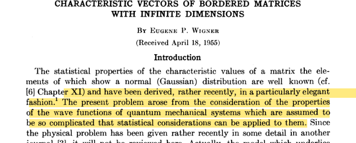
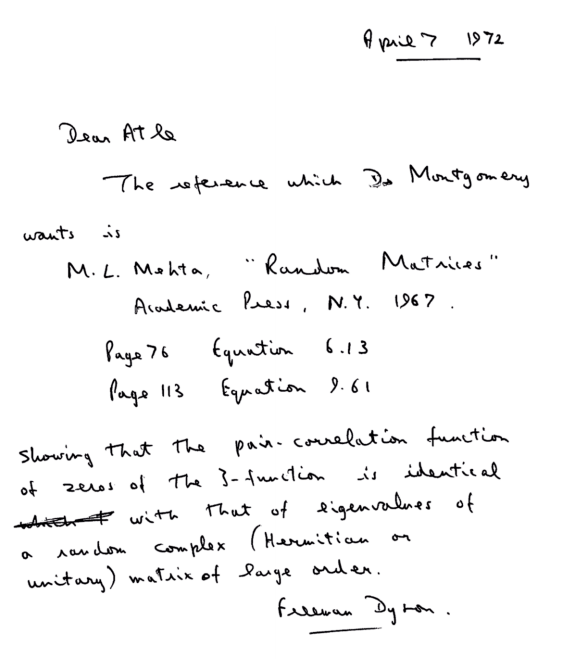

---

title: "Variações do teorema central do limite para matrizes aleatórias: de núcleos atômicos a filtragem de matrizes de correlação"

categories: []

date: '2021-12-06T00:00:00Z'


draft: no

featured: no

gallery_item: null

image:
  caption: 
  focal_point: 
  preview_only: 

projects: []

subtitle: null

summary: null

tags:
- portfolio
- correlação
- matrizes aleatórias
- teoria espectral
- python
- otmização
- autovalores
- história da ciência
authors:
- devmessias


---

No célebre trabalho "*Can One Hear the Shape of a Drum?*"[1] Kack questiona se conhecendo o espectro (*som*) de um certo operador que define as oscilações de uma membrana (*tambor*) seria possível identificar o formato de tal membrana de maneira unívoca. Discutiremos aqui como é possível ouvir matrizes de correlação usando seu espectro e como podemos remover o ruído desse som usando resultados da teoria de matrizes aleatórias. Veremos como essa filtragem pode aprimorar algoritmos de construção de carteiras de investimentos.


> Minhas motivações para escrever esse texto foram o movimento [Learn In Public-Sibelius Seraphini](https://twitter.com/sseraphini/status/1458169250326142978) e o Nobel de Física de 2021. Um dos temas de Giorgio Parisi é o estudo de matrizes aleatórias [www.nobelprize.org 2021](https://www.nobelprize.org/uploads/2021/10/sciback_fy_en_21.pdf).

..
> Jupyter notebook disponível [aqui](https://github.com/devmessias/devmessias.github.io/blob/master/content/post/random_matrix_portfolio/index.ipynb)


# 1-Introdução: teorema central do limite
O teorema central do limite está no coração da análise estatística. Em poucas palavras o mesmo estabelece o seguinte.

> Suponha uma amostra $A = (x_1, x_2, \dots, x_n)$ de uma variável aleatória com média $\mu$ e variância $\sigma^2$ finita. Se a amostragem é $i.i.d.$ o teorema central do limite estabelece que a

> distribuição de probababilidade da média amostral converge

> para uma distribuição normal com variância $\sigma^2/n$ e média $\mu$ a medida que $n$ aumenta.

Note que eu não disse nada a respeito de como tal amostra foi gerada; em nenhum momento citei distribuição de Bernoulli, Gauss, Poisson, etc. Desta maneira podemos dizer que tal convergência é uma propriedade **universal** de amostras aleatórias $i.i.d.$. Essa universalidade é poderosa, pois garante que é possível estimar a média e variância de uma população através de um conjunto de amostragens.

Não é difícil fazer um experimento computacional onde a implicação desse teorema apareça


```python
import numpy as np
import matplotlib.pyplot as plt
import pandas as pd
import seaborn as sns
import warnings
from matplotlib import style

warnings.filterwarnings('ignore')
style.use('seaborn-white')

np.random.seed(22)
```

Usaremos uma amostragem de uma distribuição exponencial com média $\mu = 4$. Tal distribuição tem uma variância dada por $1/\mu^2$. Faremos $10000$ experimentos com amostras de tamanho $500$. Posteriormente calcularemos a media de cada experimento, `mean_by_exp`


```python
rate = 0.25

mu = 1/rate

sample_size=500
exponential_sample = np.random.exponential(mu, size=(sample_size, 30000))
mean_by_exp = exponential_sample.mean(axis=0)
```

Agora basta plotar o histograma em comparação com a distribuição normal dada pelo teorema central do limite


```python
sns.distplot(mean_by_exp, norm_hist=True, label='sample')
x = np.linspace(2.5, 5.5, 100)
var = mu**2/(sample_size)
y = np.exp(-(x-mu)**2/(2*var))/np.sqrt(2*np.pi*var)
plt.plot(x, y, label=r'$N(\mu, \sigma)$', c='tomato')
plt.legend()
plt.xlim(3., 5)
plt.savefig('exponential_distribution.png', facecolor='w')
plt.close()
```


Note na figura acima que o plot para a função $\frac{e^{-\frac{(x-\mu)^2}{2\sigma^2}}}{\sqrt(2\pi\sigma^2)}$ e o histograma coincidem. Você pode testar essa coincidência com outras distribuições, o mesmo comportamento se repetira. É isso que quero dizer com **universalidade**.


Um questionamento válido é que estamos tratando apenas de uma variável aleatória e sua amostragem. Mas no mundo real existem outras estruturas mais intricadas. Por exemplo
pegue um conjunto de variáveis aleatórias
$\mathcal C=(X_{1 1}, X_{1 2}, \cdots, X_{N N})$, suponha que exista uma certa **simetria** nesse conjunto, uma possibilidade é $X_{i j} = X_{j i}$.
Não é difícil imaginar situações onde tal conjunto apareça.

Podemos armazenar uma realização de $\mathcal C$ em uma matriz que nada mais é que um grafo completo com pesos. Ao estudar essas matrizes oriundas desse tipo de amostragem entramos em um novo campo da matemática, o campo das matrizes aleatórias.
Nesse campo de estudos uma amostragem não retorna um número, mas sim uma matriz.

A função `normalRMT` apresentada abaixo é um gerador de matrizes aleatórias conhecidas como Gaussianas ortogonais.


```python
def normalRMT(n=100):
"""Generate a random matrix with normal distribution entries
Args:
n : (int) number of rows and columns
Returns:
m : (numpy.ndarray) random matrix

"""
std = 1/np.sqrt(2)
m = np.random.normal(size=(n,n), scale=std)
m = (m+m.T)
m /= np.sqrt(n)
return m
np.set_printoptions(precision=3)
print(f'{normalRMT(3)},\n\n{normalRMT(3)}')
```

[[-1.441e+00 -2.585e-01 -1.349e-01]
[-2.585e-01 -2.304e-01 1.166e-03]
[-1.349e-01 1.166e-03 -1.272e+00]],

[[-0.742 0.607 -0.34 ]
[ 0.607 0.678 0.277]
[-0.34 0.277 -0.127]]


Sabemos que quando estamos trantando de variáveis aleatórias o teorema central do limite é importantíssimo. O que você pode se perguntar agora é: **Existe um análogo para o teorema central do limite para matrizes aleatórias?**

# 2-Núcleos atômicos, gás de números primos e universalidade


Para o bem e para o mal o conhecimento da física atômica foi um dos temas mais importantes desenvolvidos pela humanidade. Portanto, não é de se estranhar que após o ano de 1930 iniciou-se uma grande corrida para compreender núcleos atômicos pesados e a física de nêutrons [13].

Para compreender essa nova física de nêutrons era necessário conhecer a organização do espectro de ressonância dos núcleos pesados (esse espectro nada mais é que os autovalores de um operador muito especial). Uma maneira de se fazer isso é do jeito que muitas das coisas são estudadas na física: pegando se uma coisa e jogando na direção da coisa a ser estudada. Essa metodologia experimental torna possível amostrar alguns valores possíveis para o espectro. Contudo, acredito que não preciso argumentar que fazer isso naquela época era extremamente difícil e caro. Poucos centros conseguiam realizar alguns experimentos e ainda com uma resolução muito baixa para obter resultados suficientes para uma compreensão adequada dos núcleos. Era preciso uma saída mais barata e ela foi encontrada. Tal saída dependeu apenas de física-matemática e maços de papel.


Dentre os pioneiros que decidiram atacar o problema de núcleos pesados usando matemática temos Eugene Paul Wigner (Nobel de 1963). A grande sacada de Wigner foi perceber que o fato das interações nucleares serem tão complicadas e a infinitude de graus de liberdade seria possível tentar compreender essas interações como uma amostragem sujeita a certas condições de simetria.[10 , 11]




Aqui com simetria queremos dizer que as matrizes envolvidas possuem certas restrições tais como

```python
np.assert_equal(A, A.T)
```

Na próxima seção veremos qual o impacto dessas restrições na distribuição de autovalores das matrizes envolvidas.


## 2-a) Universalidade e lei do semicírculo


A função `normalRMT` gera uma matriz simétrica onde as entradas são extraídas de uma distribuição normal. A função `laplaceRMT` gera também uma matriz simétrica, contudo as entradas são amostras de uma distribuição de Laplace.


```python

def laplaceRMT(n=100):
"""Generate a random matrix with Laplace distribution
Args:
n : (int) size of the matrix
Returns:
m : (numpy.ndarray) random matrix with Laplace distribution

"""
# we know that the variance of the laplace distribution is 2*scale**2
scale = 1/np.sqrt(2)
m = np.zeros((n,n))

values = np.random.laplace(size=n*(n-1)//2, scale=scale)
m[np.triu_indices_from(m, k=1)] = values
# copy the upper diagonal to the lower diagonal
m[np.tril_indices_from(m, k=-1)] = values
np.fill_diagonal(m, np.random.laplace(size=n, scale=scale))
m = m/np.sqrt(n)
return m
```

As propriedades **universais** que iremos explorar aqui estão ligadas aos autovalores das matrizes que foram amostradas. Como nossas matrizes são simétricas esses autovalores são todos reais.

Como cada matriz é diferente os autovalores também serão, eles também são variáveis aleatórias.


```python
vals_laplace = np.array([
np.linalg.eigh(laplaceRMT(n=100))[0]
for i in range(100)
])
vals_normal = np.array([
np.linalg.eigh(normalRMT(n=100))[0]
for i in range(100)
])
```
 
Na decáda de 50 não havia poder computacional
suficiente para realizar investigações númericas, mas você pode facilmente investigar como os autovalores se distribuem usando seu computador e gerando os histogramas


```python
t = 1
x = np.linspace(-2*t, 2*t, 100)
y = np.zeros_like(x)
x0 = x[4*t-x*2>0]
y[4*t-x*2>0] = np.sqrt(4*t-x0**2)/(2*np.pi*t)

plt.figure(facecolor='white')
plt.hist(vals_laplace.flatten(), bins=50,
hatch ='|',
density=True, label='laplace', alpha=.2)
plt.hist(vals_normal.flatten(), bins=50,
hatch ='o',
density=True, label='normal', alpha=.2)
#sns.distplot(vals_laplace, norm_hist=True, label='Laplace')
#sns.distplot(vals_normal, norm_hist=True, label='Normal')

#sns.distplot(vals2, norm_hist=True, label='sample2')
plt.plot(x, y, label='analytical')
plt.xlabel(r'$\lambda$')
plt.ylabel(r'$\rho(\lambda)$')
plt.legend()
plt.savefig('RMT_distribution.png', facecolor='w')
plt.close()
```


Veja na figura acima que a distribuição de autovalores de matrizes simétricas relacionadas com a distribuição normal e de Laplace coincidem. O que estamos vendo aqui é uma propriedade **universal**! Espero que você acredite em mim, mas dado que você tenha uma matriz aleatória simétrica, quadrada e se as entradas são $i.i.d.$ a distribuição de autovalores seguem o que é conhecido como lei de semicírculo de Wigner. Se a média e variância das entradas da matriz são $0$ e $1$ respectivamente, então tal lei tem a seguinte expressão para a distribuição de probabilidade dos autovalores
$$
\rho(\lambda) = \begin{cases}
\frac{\sqrt{4-\lambda^2}}{(2\pi)} \textrm{ se } 4-\lambda^2 \leq 0\newline
0 \textrm{ caso contrário.}
\end{cases}
$$

Se trocarmos as simetrias, restrições ou formato (`array.shape[0]!=array.shape[1]`) das matrizes podemos encontrar variações da distribuição apresentada acima. Exemplo se a matriz é complexa mas Hermitiana, ou se é "retangular" e real tal como algums matrizes que são usadas para otimizar carteiras de investimento. A próxima seção mostrará um caso com outro formato para universalidade.


## 2-b) Repulsão entre números primos


Inciamos nosso texto falando sobre como a teoria de matrizes aleatórias floreceu com os estudos estatísticos de núcleos atômicos pesados, especificamente nos trabalhos de Wigner. Embora tenha essa origem, muitas vezes ferramentas matemáticas desenvolvidas apenas por motivações práticas alcançam outros ramos da matemática. Brevemente discutirei aqui alguns pontos e relações com uma das conjecturas mais famosas da matemática: a hipótese de Riemann.


Qualquer pessoa com alguma curiosidade sobre matemática já ouviu falar sobre a hipótese de Riemann. Essa hipótese estabele uma relação entre os zeros da função zeta de Riemann e a distribuição de números primos. Dada sua importância os maiores ciêntistas do século XX se debruçaram sobre ela almejando a imortalidade. Um desses ciêntistas foi Hugh Montgomery[4].

Por volta de 1970 Montgomery notou que os zeros da função zeta tinham uma certa propriedade cuirosa, pareciam repelir uns aos outros. Uma expressão foi obtidada, que é a seguinte

$$
1 - \left( \frac{\sin (\pi u)}{\pi u}\right)^2 + \delta(u)
$$

Não se preocupe em entender a expressão acima, ela está aqui apenas for motivos estéticos.
O que importa é que ela é simples, tão simples que quando Freeman Dyson - um dos gigantes da física-matemática - colocou os olhos sobre tal equação ele notou imediatamente que tal equação era idêntica a obtida no contexto de matrizes aleatórias Hermitianas (uma matriz é hermitiana se ela é igual a sua transporta conjugada) utilizadas para compreender o comportamento de núcleos de átomos pesados, tais como urânio. A imagem abaixo é uma carta escrita por Dyson.



As conexão entre um ferramental desenvolvido para estudar núcleos atômicos e números primos era realmente inesperada e talvez seja um dos caminhos para a prova da hipotese de Riemann[5, 2]. Contudo deixemos a história de lado, e voltemos ao ponto principal que é te dar outro exemplo de universalidade.

Lembra que Montgomery disse que parecia haver uma repulsão entre os zeros da função Zeta? O que seria esse conceito de repulsão em matrizes aleatórias? Vamos checar numericamente

Voltaremos a usar nossas matrizes aleatórias geradas por distribuições Gaussianas e Laplacianas. Usando o mesmo conjunto de autovalores que obtivemos anteriormente iremos calular o espaçamento entre cada par de autovalores para cada realização de uma matriz aleatória. É bem fácil, basta chamar a função `diff` do numpy


```python
diff_laplace = np.diff(vals_laplace, axis=1)
diff_normal = np.diff(vals_normal, axis=1)
```

Agora o que faremos é estimar a densidade de probabilidade usnado KDE. Mas antes disso aqui vai uma dica:

>**Evite o KDE do sklearn no seu dia a dia, a implementação é lenta e não flexivél. Difícilmente você conseguirá bons resultados com milhões de pontos. Aqui vou usar uma implementação de KDE mais eficiente você pode instalar ela execuntando o comando abaixo**


```python
!pip install KDEpy
```


```python
from KDEpy import FFTKDE

estimator_normal = FFTKDE( bw='silverman').fit(diff_normal.flatten())
x_normal, probs_normal = estimator_normal.evaluate(100)
mu_normal = np.mean(diff_normal, axis=1).mean()

estimator_laplace = FFTKDE( bw='silverman').fit(diff_laplace.flatten())
x_laplace, probs_laplace = estimator_laplace.evaluate(100)
mu_laplace = np.mean(diff_laplace, axis=1).mean()
```


```python
goe_law = lambda x: np.pi*x*np.exp(-np.pi*x**2/4)/2
spacings = np.linspace(0, 4, 100)
p_s = goe_law(spacings)

plt.plot(spacings, p_s, label=r'GOE analítico', c='orange', linestyle='--')
plt.plot(
x_normal/mu_normal,
probs_normal*mu_normal,
linestyle=':',
linewidth=2,
zorder=1,
label='normal', c='black')
plt.plot(x_laplace/mu_laplace, probs_laplace*mu_laplace, zorder=2,
linestyle='--', label='laplace', c='tomato')
plt.legend()
plt.savefig('RMT_diff_distribution.png', facecolor='w')
plt.close()
```


O que as distribuições acima dizem é que dado sua matriz ser $i.i.d.$ quadrada e simétrica então a probabilidade que você encontre dois autovalores iguais é $0$ (zero). Além do mais, existe um ponto de máximo global em relação a distribuição de espaçamentos. Esse comportamento que balanceia repulsão e atração dos autovalores lembra o comportamento de partículas em um fluído. Não é de espantar que o método matemático desenvolvido por Wigner para compreender tais matrizes foi denominado Gás de Coloumb[2].

Agora que você tem pelo menos uma ideia do que seria essa repulsão para o caso que já abordamos (matrizes simétricas quadradas) voltemos ao problema dos números primos.

O comando a seguir baixa os primeiros 100k zeros da função zeta


```python
!wget http://www.dtc.umn.edu/~odlyzko/zeta_tables/zeros1
```

Um pequeno preprocessamento dos dados:


```python
zeros = []
with open('zeros1', 'r') as f:
for line in f.readlines():
# remove all spaces in the line and convert it to a float
zeros.append(float(line.replace(' ', '')))
zeta_zeros = np.array(zeros)
```

Iremos calcular os espaçamentos entre os zeros, a média de tais espaçamento e executar um KDE


```python
from KDEpy import FFTKDE

diff_zeta = np.diff(zeta_zeros[10000:])
m = np.mean(diff_zeta)
estimator = FFTKDE( bw='silverman').fit(diff_zeta)

```


```python
x, probs = estimator.evaluate(100)
p = np.pi
goe_law = lambda x: p*x*np.exp(-p*x**2/4)/2
def gue(xs):
arg = -4/np.pi*np.power(xs,2)
vals = 32/np.pi**2*xs**2*np.exp(arg)
return vals
spacings = np.linspace(0, 4, 100)
p_s = gue(spacings)
p_s2 = goe_law(spacings)
plt.plot(x/m, probs*m, label='zeros zeta', linestyle='--')
plt.plot(spacings, p_s, label=r'GUE analítico', c='blue', linestyle='-.')
plt.plot(spacings, p_s2, label=r'GOE analitico', c='orange', linestyle='-.')
plt.xlim(-0.1, 4)
plt.legend()
plt.savefig('zeta.png', facecolor='w')
plt.close()
```


Veja que a propriedade de repulsão apareceu novamente. Note que dentro do plot eu coloquei uma outra curva `GOE analítico`, essa curva é aquela que melhor descreve a distribuição de espaçamentos quando suas matrizes aleatórias são simétricas. Isso é uma lição importante aqui e resalta o que eu já disse anteriormente. Não temos apenas *"um limite central para matrizes aleatórias*", mas todo um **zoológico que mudará dependendo do tipo do seu problema.**.

# 3-Usando *RMT* para encontrar e filtrar ruídos em matrizes

Na seção 1 relembramos o resultado do teorema central do limite. Na seção 2 foi mostrado que devemos ter em mente as simetrias e restrições do nosso problema para analisar qual regra de universalidade é respeitada. Isto é: a depender da simetria e restrições das nossas matrizes temos um outro "*timbre de universalidade*".

Um exemplo de outro timbre surge no espectro de matrizes de correlação; matrizes que são comumente utilizadas para análise de carteiras de investimento. Tais matrizes tem **pelo menos a seguinte estrutura**:

$$
\mathbf C = \mathbf X \mathbf X^T
$$
onde $\mathbf X$ é uma matriz real $N\times M$ e $M>N$.

O código abaixo permite explorar em um exemplo o espectro de matrizes aleatórias $N\neq M$ com entradas dadas pela distribuição normal.


```python
def get_marchenko_bounds(Q, sigma=1):
"""Computes the Marchenko bounds for a given Q and sigma.

Args:
Q : (float) The Q-value.
sigma : (float) The std value.
Returns:
(float, float): The lower and upper bounds for the eigenvalues.

"""
QiSqrt = np.sqrt(1/Q)
lp = np.power(sigma*(1 + QiSqrt),2)
lm = np.power(sigma*(1 - QiSqrt),2)
return lp, lm

def marchenko_pastur(l, Q, sigma=1):
"""Return the probability of a Marchenko-Pastur distribution for
a given Q , sigma and eigenvalue.

Args:
l : (float) The eigenvalue.
Q : (float) The Q-value.
sigma : (float) The std value.
Returns:
(float): The probability
"""
lp, lm = get_marchenko_bounds(Q, sigma)
# outside the interval [lm, lp]
if l > lp or l < lm:
return 0
return (Q/(2*np.pi*sigma*sigma*l))*np.sqrt((lp-l)*(l-lm))

def plot_marchenko_pastur(ax, eigen_values, Q, sigma=1, bins=100, just_the_bulk=False):
"""Plots the Marchenko-Pastur distribution for a given Q and sigma

Args:
ax : (matplotlib.axes) The axes to plot on.
eigen_values : (np.array) The eigenvalues.
Q : (float) : The Q-value.
sigma : (float) std
bins : (int) The number of bins to use.
just_the_bulk : (bool) If True, only the eigenvalues inside of
the Marchenko-Pastur bounds are plotted.

"""
l_max, l_min = get_marchenko_bounds(Q, sigma)
eigenvalues_points = np.linspace(l_min, l_max, 100)
pdf = np.vectorize(lambda x : marchenko_pastur(x, Q, sigma))(eigenvalues_points)
if just_the_bulk:
eigen_values = eigen_values[ (eigen_values < l_max)]
ax.plot(eigenvalues_points, pdf, color = 'r', label='Marchenko-Pastur')
ax.hist(eigen_values, label='sample', bins=bins , density=True)
ax.set_xlabel(r"$\lambda$")
ax.set_ylabel(r"$\rho$")
ax.legend()

N = 1000
T = 4000
Q = T/N

X = np.random.normal(0,1,size=(N,T))
cor = np.corrcoef(X)
vals = np.linalg.eigh(cor)[0]

fig, ax = plt.subplots(1,1)
plot_marchenko_pastur(ax, vals, Q, sigma=1, bins=100)

plt.legend()
plt.savefig('Marchenko_Pastur.png', facecolor='w')
plt.close()
```


A função em vermelho na figura acima é a **universalidade** que aparece em matrizes com a restrição $N\times M$ e entradas $i.i.d.$ e média $0$. Tal **universalidade** tem como formato a distribuição de Marchenko-Pastur que é dada por

$$
\rho (\lambda) = \frac{Q}{2\pi \sigma^2}\frac{\sqrt{(\lambda_{\max} - \lambda)(\lambda - \lambda_{\min})}}{\lambda}
$$
onde
$$
\lambda_{\max,\min} = \sigma^2(1 \pm \sqrt{\frac{1}{Q}})^2.
$$

Note os parâmetros como $Q$ e $\sigma$. Tais parâmetros precisam ser ajustados para obter um melhor fit com dados reais.


Agora iremos para um caso real. Vamos usar dados obtidos via Yahoo Finance com a biblioteca `yfinance` para consturir uma matriz de correlação com dados de ativos financeiros


```python
# você precisa desse pacote para baixar os dados
!pip install yfinance
```

Isso aqui é um post bem informal, então peguei peguei uma lista aleatória com alguns tickers que encontrei na internet


```python

!wget https://raw.githubusercontent.com/shilewenuw/get_all_tickers/master/get_all_tickers/tickers.csv
```

selecionei apenas 500 para evitar que o processo de download seja muito demorado


```python
tickers = np.loadtxt('tickers.csv', dtype=str, delimiter=',').tolist()
tickers = np.random.choice(tickers, size=500, replace=False).tolist()
```

vamos baixar agora os dados em um periódo específico


```python

import yfinance as yf

df = yf.download (tickers,
start="2017-01-01", end="2019-10-01",
interval = "1d",
group_by = 'ticker',
progress = True)
```

o `yfinance` vai gerar um dataframe com multiindex, então precisamos separar da
forma que queremos


```python

tickers_available = list(set([ ticket for ticket, _ in df.columns.T.to_numpy()]))
prices = pd.DataFrame()
for ticker in tickers_available:
try:
prices[ticker] = df[(ticker, 'Adj Close')]
except KeyError:
pass
```

Agora iremos calcular o retorno. Aqui entra um ponto delicado. Você poderá achar alguns posts na internet ou mesmo artigos argumentando que é necessário calcular o retorno como
$\log (r+1)$ pois assim as entradas da sua matriz seguirá uma distribuição normal o que permitirá a aplicação de RMT. Já vimos no presente texto que não precisamos que as entradas da matrizes venham de uma distribuição normal para que a **universalidade** apareça. A escolha ou não de usar $\log$ nos retornos merece mais atenção, inclusive com críticas em relação ao uso[6, 7, 8]. Mas esse post não pretende te vender nada, por isso vou ficar com o mais simples.


```python
# calculamos os retornos
returns_all = prices.pct_change()

# a primeira linha não faz sentido, não existe retorno no primeiro dia
returns_all = returns_all.iloc[1:, :]

# vamos limpar todas as linhas se mnegociação e dropar qualquer coluna com muitos NaN
returns_all.dropna(axis = 1, thresh=len(returns_all.index)/2, inplace=True)
returns_all.dropna(axis = 0, inplace=True)
# seleciona apenas 150 colunas
returns_all = returns_all[np.random.choice(returns_all.columns, size=120, replace=False)]
#returns_all = returns_all.iloc[150:]
```

Com o `df` pronto calcularemos a matriz de correlação e seus autovalores


```python
correlation_matrix = returns_all.interpolate().corr()
vals = np.linalg.eigh(correlation_matrix.values)[0]
```

Vamos usar os parâmetros padrões para $Q$ e $\sigma$ e torcer para que funcione


```python

T, N = returns_all.shape
Q=T/N
sigma= 1

fig, ax = plt.subplots(1,1)
plot_marchenko_pastur(ax, vals, Q, sigma=1, bins=200, just_the_bulk=False)

plt.legend()
plt.savefig('Marchenko_Pastur_all.png', facecolor='w')
plt.close()
```


Usando todo o intervalo de tempo do nosso `df` obtivemos o que parece um ajuste razoável. É claro que você poderia (deveria) rodar algum teste estatistico para verificar tal ajuste.
Existem alguns trabalhos que fizeram essa análise de forma rigorosa, comparando mercados e periódos específicos em relação a distribuição de Marchenko-Pastur[9].

Se você for uma pessoa atenta notará que na imagem acima existem alguns autovalores fora do suporte da Marchenko-Pastur. A ideia de filtragem via RMT é como dito em [9] testar seus dados em relação a "*hipótese nula*" da RMT. No caso se seus autovalores estão dentro do *bulk* da distribuição que descreve um modelo de entradas *i.i.d.*.


Como isso foi aplicado em alguns trabalhos? Vamos ver na prática.


Usaremos $70$% da série histórica para calcular uma nova matriz de correlação. Com a matriz de correlação em mãos vamos computar os autovalores e autovetores.


```python
# iremos usar 70% da serie para realizar a filtragem
returns_all.shape[0]*0.70
n_days = returns_all.shape[0]
n_days_in = int(n_days*(1-0.70))


returns = returns_all.copy()
sample = returns.iloc[:(returns.shape[0]-n_days_in), :].copy()

correlation_matrix = sample.interpolate().corr()
vals, vecs = np.linalg.eigh(correlation_matrix.values)

```

Os autovalores e autovetores podem ser compreendidos como a decomposição de uma dada matriz.
Portanto, o seguinte teste precisa passar


```python
assert np.abs(
np.dot(vecs, np.dot(np.diag(vals), np.transpose(vecs))).flatten()
- correlation_matrix.values.flatten()
).max() < 1e-10
```

A distribuição de Marchenko-Pastur serve como um indicativo para nossa filtragem. O que faremos é jogar fora todos os autovalores
que estão dentro da distribuição de Marchenko-Pastur, posteriormente reconstruiremos a matriz de correlação.


```python
T, N = returns.shape
Q=T/N
sigma = 1
lp, lm = get_marchenko_bounds(Q, sigma)

# Filter the eigenvalues out
vals[vals <= lp ] = 0
# Reconstruct the matrix
filtered_matrix = np.dot(vecs, np.dot(np.diag(vals), np.transpose(vecs)))
np.fill_diagonal(filtered_matrix, 1)

```

Com a matriz de correlação filtrada você pode fazer o que bem entender com ela - existem outras maneiras de se realizar uma filtragem - uma das possíveis aplicações que precisa ser utilizada com cuidado é usar tal matriz filtrada como input para algoritmos de otimização de carteira. Talvez faça um outro post descrevendo essa otimização de forma mais clara, mas esse não é meu enfoque nesse post e nem minha especialidade. Portanto, se você quiser dar uma lida recomendo os seguintes posts: [17, 18]


O que você precisa saber é que uma matriz de covariância, $\mathbf C_\sigma$, adimite uma decomposição em relação a matriz de correlação atráves da seguinte forma

$$
\mathbf C_\sigma = \mathbf D^{-1/2} \mathbf C \mathbf D^{-1/2}
$$
onde $\mathbf D^{-1/2}$ é uma matriz diagonal com as entradas sendo os desvios padrão para cada serie de dados, isto é
$$
\begin{bmatrix}
\sigma_{1} &0 &\cdots &0 \\\
0 &\sigma_{2} &\cdots &0 \\\
\vdots &\vdots &\ddots &\vdots \\\
0 &0 &\cdots &\sigma_{M} \end{bmatrix}
$$

Discutimos uma maneira de obter uma matriz de correlação filtrada, $\mathbf{\tilde C}$, através de RMT,
a ideia é plugar essa nova matriz na equação anterior e obter uma nova matriz de covariância onde as informações menos relevantes foram eliminadas.

$$
\mathbf{\tilde C_\sigma} = \mathbf D^{-1/2} \mathbf{\tilde C} \mathbf D^{-1/2}.
$$

Tendo essa nova matriz de covâriancia filtrada agora basta você ingerir ela em algum método preferido para otimização e comparar com o resultado obtido usando a matriz original. Aqui usaremos o clássico Markowitz


```python
# Reconstruct the filtered covariance matrix
covariance_matrix = sample.cov()
inv_cov_mat = np.linalg.pinv(covariance_matrix)

# Construct minimum variance weights
ones = np.ones(len(inv_cov_mat))
inv_dot_ones = np.dot(inv_cov_mat, ones)
min_var_weights = inv_dot_ones/ np.dot( inv_dot_ones , ones)


variances = np.diag(sample.cov().values)
standard_deviations = np.sqrt(variances)

D = np.diag(standard_deviations)
filtered_cov = np.dot(D ,np.dot(filtered_matrix,D))
filtered_cov = filtered_matrix

filtered_cov = (np.dot(np.diag(standard_deviations),
np.dot(filtered_matrix,np.diag(standard_deviations))))

filt_inv_cov = np.linalg.pinv(filtered_cov)

# Construct minimum variance weights
ones = np.ones(len(filt_inv_cov))
inv_dot_ones = np.dot(filt_inv_cov, ones)
filt_min_var_weights = inv_dot_ones/ np.dot( inv_dot_ones , ones)
def get_cumulative_returns_over_time(sample, weights):
weights[weights <= 0 ] = 0
weights = weights / weights.sum()
return (((1+sample).cumprod(axis=0))-1).dot(weights)

cumulative_returns = get_cumulative_returns_over_time(returns, min_var_weights).values
cumulative_returns_filt = get_cumulative_returns_over_time(returns, filt_min_var_weights).values


```


```python

in_sample_ind = np.arange(0, (returns.shape[0]-n_days_in+1))
out_sample_ind = np.arange((returns.shape[0]-n_days_in), returns.shape[0])
f = plt.figure()

ax = plt.subplot(111)
points = np.arange(0, len(cumulative_returns))[out_sample_ind]
ax.plot(points, cumulative_returns[out_sample_ind], 'orange', linestyle='--', label='original')

ax.plot(points, cumulative_returns_filt[out_sample_ind], 'b', linestyle='-.', label='filtrado')
ymax = max(cumulative_returns[out_sample_ind].max(), cumulative_returns_filt[out_sample_ind].max())
ymin = min(cumulative_returns[out_sample_ind].min(), cumulative_returns_filt[out_sample_ind].min())
plt.legend()
plt.savefig('comp.png', facecolor='w')
plt.close()

```


Obtivemos uma melhora, mas novamente ressaltamos que uma analise mais criteriosa deveria ter sido feita. Vamos listar alguns pontos

1. Em relação a questão da escolha do intervalo de tempo. Isto é, se o tamanho foi pequeno de mais para capturar a correlação ou se foi grande de mais tal que as correlações entre ativos não são estacionárias.
2. O (não) uso do $\log$-retorno e seu impacto
3. Uma escolha não aleatória do que seria analisado
4. Métodos de unfolding dos autovalores (tema para outro post)

# 5 - Vantagens, críticas e sugestões

Você poderá encontrar alguns trabalhos e posts descrevendo o uso de matrizes aleatórias para filtragem de matrizes de correlação sem uma boa crítica ou explicitação das limitações vou linkar aqui alguns pontos positivos e negativos e limitações

## Onde realmente RMT se mostrou útil

- Obviamente a RMT é indiscutivelmente bem sucedida na matemática e física permitindo compreender sistemas apenas analisando a estatística dos *gases matriciais*.
- Em machine learning a RMT também está provando ser uma ferramenta útil para compreender e melhorar o processo de aprendizado [15].
- Entender comportamentos de sistemas sociais, biológicos e econômicos. Aqui com entender o comportamento digo apenas saber se um dado segue uma característica dada por alguma lei específica como a lei de semicírculo. Isto é, não existe discussão em você pegar um dado sistema que é representado por uma matriz, estudar o comportamento do seu espectro de autovalores e autovetores e verificar que seguem algumas lei de universalidade. **Isso é bem diferente de dizer que se você filtrar uma matriz de correlação via RMT você irá obter sempre resultados melhores.**

## Limitações
- Note que não realizamos nenhum tipo de teste para decidir se realmente a distribuição de autovalores era a distribuição desejada. Baseamos isso só no olhometro, obviamente não é uma boa ideia.
- A filtragem apenas removendo os autovalores apesar de simples é limitada e pode ser contra produtiva, outros métodos de filtragem podem ser inclusive melhores[14]. Inclusive não é uma das únicas aplicações de RMT para tratamento desse tipo de dado [16]

## Para conhecer mais

### Ciêntistas
- Alguns grandes nomes de RMT: Madan Lal Mehta, Freeman Dyson e Terrence Tao
- Alguns brasileiros: Marcel Novaes autor do livro [Introduction to Random Matrices - Theory and Practice](https://link.springer.com/book/10.1007/978-3-319-70885-0)-[arxiv](https://arxiv.org/abs/1712.07903); Fernando Lucas Metz trabalhou com o Nobel Giorgio Parisi.

### Encontrou um erro ou quer melhorar esse texto?

- Faça sua contribuição criando uma [issue](https://github.com/devmessias/devmessias.github.io/issues/new) ou um PR editando esse arquivo aqui [random_matrix_theory/index.md](https://github.com/devmessias/devmessias.github.io/blob/master/content/post/random_matrix_theory/index.md).


# 6-Referências

- [1] M. Kac, "Can One Hear the Shape of a Drum?," The American Mathematical Monthly, vol. 73, no. 4, p. 1, Apr. 1966, doi: 10.2307/2313748.
- [2] Wigner, E.P., 1957. Statistical properties of real symmetric matrices with many dimensions (pp. 174-184). Princeton University.
- [4] "From Prime Numbers to Nuclear Physics and Beyond," Institute for Advanced Study. https://www.ias.edu/ideas/2013/primes-random-matrices (accessed Sep. 30, 2020).
- [5] "GUE hypothesis," What's new. https://terrytao.wordpress.com/tag/gue-hypothesis/ (accessed Nov. 22, 2021).
- [6] R. Hudson and A. Gregoriou, "Calculating and Comparing Security Returns is Harder than you Think: A Comparison between Logarithmic and Simple Returns," Social Science Research Network, Rochester, NY, SSRN Scholarly Paper ID 1549328, Feb. 2010. doi: 10.2139/ssrn.1549328.
- [7] A. Meucci, "Quant Nugget 2: Linear vs. Compounded Returns - Common Pitfalls in Portfolio Management," Social Science Research Network, Rochester, NY, SSRN Scholarly Paper ID 1586656, May 2010. Accessed: Dec. 01, 2021. [Online]. Available: https://papers.ssrn.com/abstract=1586656
- [8] Lidian, "Analysis on Stocks: Log(1+return) or Simple Return?," Medium, Sep. 18, 2020. https://medium.com/@huangchingchiu/analysis-on-stocks-log-1-return-or-simple-return-371c3f60fab2 (accessed Nov. 25, 2021).
- [9] N. A. Eterovic and D. S. Eterovic, "Separating the Wheat from the Chaff: Understanding Portfolio Returns in an Emerging Market," Social Science Research Network, Rochester, NY, SSRN Scholarly Paper ID 2161646, Oct. 2012. doi: 10.2139/ssrn.2161646.
- [10] E. P. Wigner, "Characteristic Vectors of Bordered Matrices With Infinite Dimensions," Annals of Mathematics, vol. 62, no. 3, pp. 548-564, 1955, doi: 10.2307/1970079.
- [11] E. P. Wigner, "On the statistical distribution of the widths and spacings of nuclear resonance levels," Mathematical Proceedings of the Cambridge Philosophical Society, vol. 47, no. 4, pp. 790-798, Oct. 1951, doi: 10.1017/S0305004100027237.
- [13] F. W. K. Firk and S. J. Miller, "Nuclei, Primes and the Random Matrix Connection," Symmetry, vol. 1, no. 1, pp. 64-105, Sep. 2009, doi: 10.3390/sym1010064.
- [14] L. Sandoval, A. B. Bortoluzzo, and M. K. Venezuela, "Not all that glitters is RMT in the forecasting of risk of portfolios in the Brazilian stock market," Physica A: Statistical Mechanics and its Applications, vol. 410, pp. 94-109, Sep. 2014, doi: 10.1016/j.physa.2014.05.006.
- [15] M. E. A. Seddik, C. Louart, M. Tamaazousti, and R. Couillet, "Random Matrix Theory Proves that Deep Learning Representations of GAN-data Behave as Gaussian Mixtures," arXiv:2001.08370 [cs, stat], Jan. 2020, Accessed: Dec. 05, 2021. [Online]. Available: http://arxiv.org/abs/2001.08370
- [16] D. B. Aires, "Análise de crises financeiras brasileiras usando teoria das matrizes aleatórias," Universidade Estadual Paulista (Unesp), 2021. Accessed: Dec. 05, 2021. [Online]. Available: https://repositorio.unesp.br/handle/11449/204550

- [17] S. Rome, "Eigen-vesting II. Optimize Your Portfolio With Optimization," Scott Rome, Mar. 22, 2016. http://srome.github.io//Eigenvesting-II-Optimize-Your-Portfolio-With-Optimization/ (accessed Dec. 05, 2021).
- [18] "11.1 Portfolio Optimization - MOSEK Fusion API for Python 9.3.10." https://docs.mosek.com/latest/pythonfusion/case-studies-portfolio.html (accessed Dec. 05, 2021).
